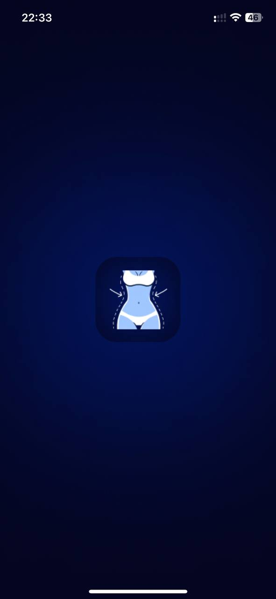
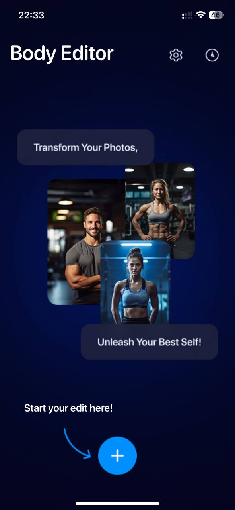
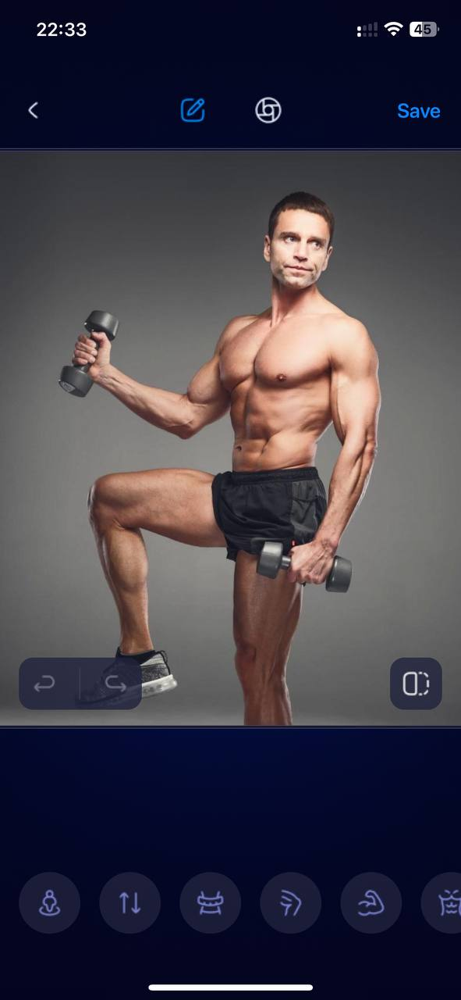
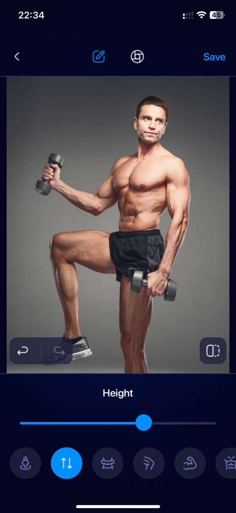
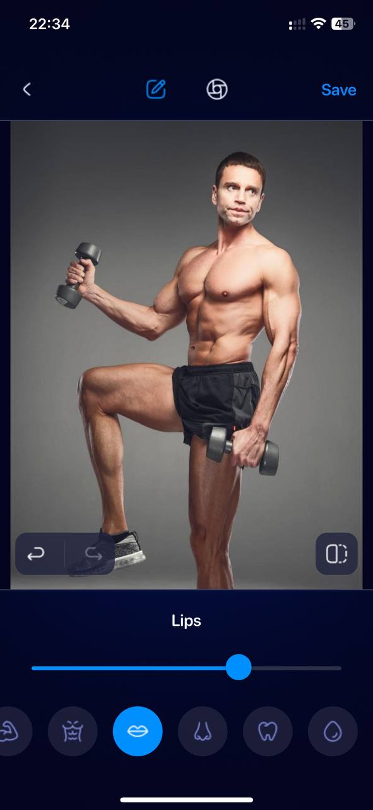
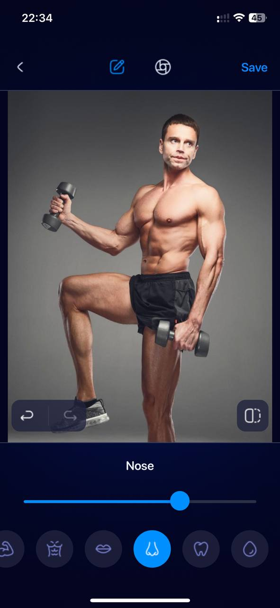
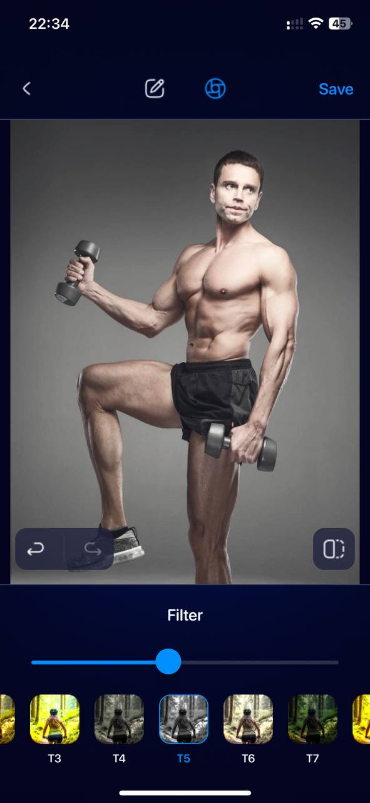
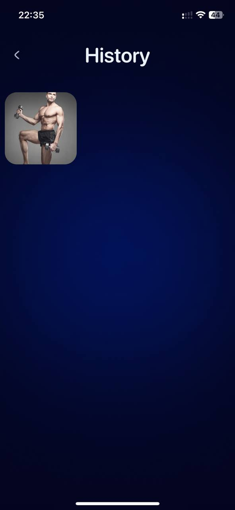
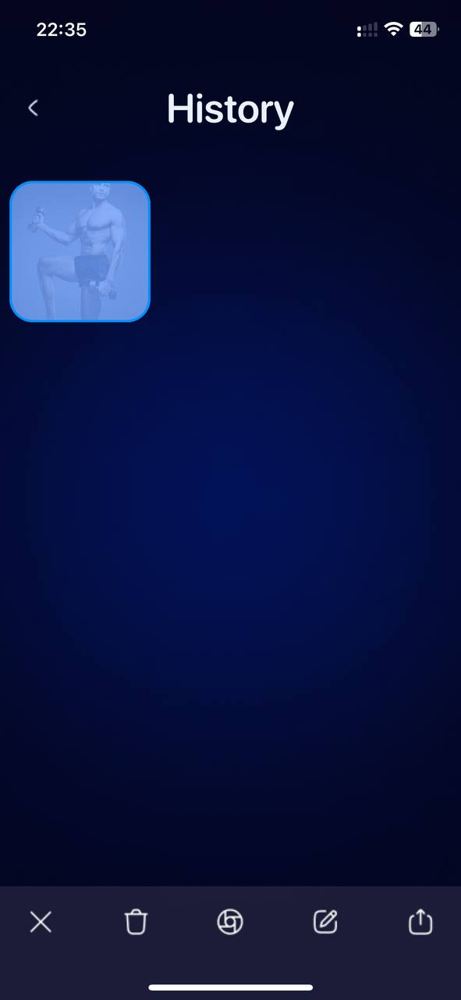

# BodyEditor

**BodyEditor** — это мощный и интуитивно понятный фоторедактор, позволяющий изменять форму тела, ретушировать лицо и применять фильтры.

## Технические моменты:

- Архитектура: Model - View - ViewModel
- Фреймворк для распознавания точек тела и лица: **Vision**
- UI Фреймворк: **UIKit**
- Минимально поддерживаемая версия iOS: 16 (в связи с использованием Vision)
- Использован **FLAnimatedImage** для отображения GIF-анимации в экране загрузки

## Основные возможности

- Приведение формы фигуры к «песочным часам»
- Изменение роста
- Уменьшение объема талии
- Увеличение контраста на мышцах конечностей (руки, ноги)
- Добавление оверлея с мышцами пресса по регулируемой сетке
- Корректировка размеров носа
- Корректировка размера губ
- Отбеливание зубов
- Ретушь лица

## Скриншоты

### Сплэшскрин

  

### Главный экран

  

### Экран редактирования фото

  
  
  
  
  

### Экран истории редактирования

  
  

